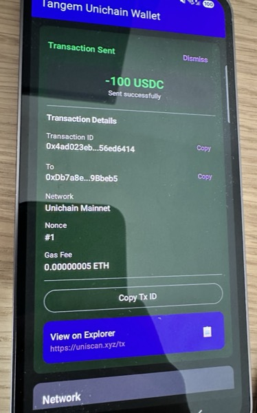

# Tangem Unichain Helper

[](https://developer.android.com)
[](https://android-arsenal.com/api?level=26)
[](https://kotlinlang.org)
[](LICENSE)
[](https://github.com/Blackmesa-Canteen/TangemUnichainHelper/actions/workflows/ci.yml)
[](https://github.com/Blackmesa-Canteen/TangemUnichainHelper/releases)

An Android app that enables **Tangem NFC card** users to transfer ETH and ERC-20 tokens on **EVM chains not supported by the official Tangem app** — with Unichain as the default.

> **Multi-Chain Architecture (v1.1.0+)**: Built with extensible multi-chain support. Ships with Unichain (mainnet) and Sepolia (testnet). Developers can easily add any EVM chain. See [DEVELOPER.md](DEVELOPER.md) for instructions.

## Download

**[Download the latest APK from Releases](https://github.com/Blackmesa-Canteen/TangemUnichainHelper/releases/latest)**

Or build from source (see below).

## Why This Exists

The official Tangem app doesn't support all EVM chains. If you have funds stuck on an unsupported chain (like Unichain) that were sent to your Tangem wallet address, this app lets you recover them using your Tangem card.

**Key Features:**
- Transfer native tokens (ETH) and ERC-20 tokens (USDC, USDT)
- **Multi-chain support** — switch between chains in the app
- Scan any Tangem card via NFC
- View token balances per chain
- Automatic gas estimation with manual editing
- Max button with automatic gas reservation
- EIP-55 address checksum validation
- Easy to extend with new tokens and chains

## Security

- **Private keys never leave your Tangem card** — all signing happens in the card's secure element
- No seed phrases, no key exports
- Transaction details shown before signing
- EIP-155 replay protection — transactions are chain-specific
- Open source — audit the code yourself
- [Security audit passed](SECURITY_AUDIT.md)

## Screenshot

<p align="center">
  
</p>

## Quick Start

### Requirements

- Android device with NFC
- Android 8.0+ (API 26)
- Tangem card

### Installation

#### Option 1: Download APK (Easiest)
1. Go to [Releases](../../releases)
2. Download the latest `app-release.apk`
3. Install on your Android device
4. Allow "Install from unknown sources" if prompted

#### Option 2: Build from Source
```bash
# Clone the repository
git clone https://github.com/Blackmesa-Canteen/TangemUnichainHelper.git
cd tangem-unichain-helper

# Build debug APK
./gradlew assembleDebug

# APK location: app/build/outputs/apk/debug/app-debug.apk
```

### Usage

1. **Select Chain** — Choose your network from the dropdown (default: Unichain)
2. **Scan Card** — Tap "Scan Card" and hold your Tangem card to the phone
3. **View Balances** — Native and token balances load automatically
4. **Send Tokens** — Enter recipient address, amount, select token
5. **Review & Sign** — Check gas fees, tap your card to sign

## Supported Chains

| Chain | Chain ID | Type | Native Token |
|-------|----------|------|--------------|
| Unichain | 130 | Mainnet (default) | ETH |
| Sepolia | 11155111 | Testnet | ETH |

> **Adding more chains?** See [DEVELOPER.md](DEVELOPER.md#adding-a-new-chain) for instructions.

## Supported Tokens (Unichain)

| Token | Contract | Decimals |
|-------|----------|----------|
| ETH | Native | 18 |
| USDC | `0x078D782b760474a361dDA0AF3839290b0EF57AD6` | 6 |
| USDT | `0x9151434b16b9763660705744891fa906f660ecc5` | 6 |

> **Note**: Token availability varies by chain. The app dynamically shows tokens available for the selected chain.

Want to add more tokens? See [Adding New Tokens](#adding-new-tokens).

## How It Works

The Tangem card signs whatever 32-byte hash you give it — it's chain-agnostic. We leverage this to sign **EIP-155 transactions** for any EVM chain:

```
1. User selects chain (e.g., Unichain, chain ID 130)
2. Create transaction (nonce, gasPrice, to, value, data)
3. Hash WITH chain ID (EIP-155 format for replay protection)
4. Tangem signs the hash (card just signs 32 bytes)
5. Encode with EIP-155 v value: chainId * 2 + 35 + recoveryId
6. Broadcast to selected chain's RPC
```

This creates a **replay-protected** transaction that's valid only on the selected chain. See [DEVELOPER.md](DEVELOPER.md) for technical details.

## Adding New Tokens

Adding a token takes 2 steps:

```kotlin
// 1. In Token.kt - Define the token (chain-agnostic)
object TokenRegistry {
    val WETH = Token.ERC20(
        symbol = "WETH",
        name = "Wrapped Ether",
        decimals = 18
    )
    // Add to allTokens list
    val allTokens = listOf(Native, USDC, USDT, WETH)
}

// 2. In TokenContractRegistry.kt - Add contract address per chain
private val contracts: Map<Long, Map<String, String>> = mapOf(
    // Unichain (130)
    130L to mapOf(
        "USDC" to "0x078D782b...",
        "USDT" to "0x9151434b...",
        "WETH" to "0x..."  // Add your token's contract address
    ),
    // Sepolia (11155111) - if token exists there
    11155111L to mapOf(
        "WETH" to "0x..."
    )
)
```

See [DEVELOPER.md](DEVELOPER.md#adding-a-new-token) for detailed instructions.

## Adding New Chains

```kotlin
// In Chain.kt - Add a new chain
data object Polygon : Chain() {
    override val chainId: Long = 137L
    override val name: String = "Polygon Mainnet"
    override val shortName: String = "Polygon"
    override val nativeCurrencySymbol: String = "MATIC"
    override val explorerUrl: String = "https://polygonscan.com"
    override val rpcUrls: List<String> = listOf(
        "https://polygon-rpc.com",
        "https://rpc-mainnet.matic.network"
    )
    override val isTestnet: Boolean = false
}

// Add to ChainRegistry.allChains
val allChains: List<Chain> = listOf(Unichain, Sepolia, Polygon)
```

See [DEVELOPER.md](DEVELOPER.md#adding-a-new-chain) for detailed instructions.

## Project Structure

```
app/src/main/java/com/example/tangemunichainhelper/
├── core/
│   ├── AddressUtils.kt          # EIP-55 address validation
│   ├── Chain.kt                 # Chain sealed class + ChainRegistry
│   ├── GasUtils.kt              # Gas formatting utilities
│   ├── NetworkConstants.kt      # (Deprecated) Use Chain.kt instead
│   ├── TangemManager.kt         # Tangem SDK wrapper
│   ├── Token.kt                 # Token sealed class + TokenRegistry
│   ├── TokenContractRegistry.kt # Chain-specific token addresses
│   └── Web3Manager.kt           # Chain-aware blockchain operations
├── ui/
│   ├── MainViewModel.kt         # State management with chain selection
│   └── theme/Theme.kt           # Material theme
├── MainActivity.kt              # Compose UI with ChainSelector
└── TangemUnichainApp.kt         # Application class
```

## Troubleshooting

### NFC Not Working
- Enable NFC in device settings
- Remove thick phone case
- Hold card flat against phone back
- Try different positions (NFC location varies by phone)

### Transaction Failed
- Ensure sufficient native token (ETH/MATIC) for gas
- Verify recipient address is correct
- Increase gas limit if needed
- Check the chain's block explorer for network status

### "Invalid Sender" Error
This means the transaction signature is invalid. If you modified the code, ensure:
- Hash uses EIP-155 format (includes chain ID)
- v value = `chainId * 2 + 35 + recoveryId`

### Balance Not Showing
- Tap refresh button
- Check internet connection
- Verify you're on the correct chain
- Verify token contract address is correct for that chain

### Wrong Chain
- Use the chain selector dropdown at the top of the app
- Each chain has separate balances and tokens

## Development

### Tech Stack

- **Language**: Kotlin
- **UI**: Jetpack Compose + Material 3
- **Blockchain**: Web3j
- **NFC**: Tangem SDK
- **Architecture**: MVVM with StateFlow

### Building

```bash
# Debug build
./gradlew assembleDebug

# Release build
./gradlew assembleRelease

# Run tests
./gradlew test
```

### Dependencies

- Tangem SDK 3.9.2
- Web3j 5.0.1
- Jetpack Compose + Material 3
- Kotlin Coroutines 1.6.4
- Timber (logging)

### Requirements

- Java 21 (required by web3j 5.0.1)

## Contributing

Contributions are welcome! Please read [CONTRIBUTING.md](CONTRIBUTING.md) first.

1. Fork the repository
2. Create a feature branch (`git checkout -b feature/amazing-feature`)
3. Commit your changes (`git commit -m 'Add amazing feature'`)
4. Push to branch (`git push origin feature/amazing-feature`)
5. Open a Pull Request

## Documentation

- [DEVELOPER.md](DEVELOPER.md) — Technical deep-dive, adding tokens and chains
- [SECURITY_AUDIT.md](SECURITY_AUDIT.md) — Security audit report
- [CONTRIBUTING.md](CONTRIBUTING.md) — Contribution guidelines
- [CHANGELOG.md](CHANGELOG.md) — Version history and release notes

## Disclaimer

**USE AT YOUR OWN RISK.**

- This software is provided "as is" without warranty
- Always test with small amounts first
- Triple-check recipient addresses — transactions cannot be reversed
- Verify you're on the correct chain before sending
- The authors are not responsible for any lost funds

## License

This project is licensed under the MIT License — see [LICENSE](LICENSE) for details.

## Acknowledgments

- [Tangem](https://tangem.com) — for the amazing NFC cards and SDK
- [Unichain](https://unichain.org) — for the network
- [Web3j](https://web3j.io) — for the Ethereum library

## Support

If this project helped you recover your funds, consider supporting development:

- **ETH/EVM**: `openjdk.eth`
- **Star this repo** to help others find it

---

**If this project helped you recover your funds, consider starring the repo**
